# 🔒 Impetus Lock | 创意施压者

[](https://github.com/YOUR_USERNAME/impetus-lock/actions/workflows/ci.yml)
[](https://opensource.org/licenses/MIT)

> **一款对抗式 AI Agent，充当你的"创意陪练"。** 通过强制植入"不可删除的创作束缚"来破除心理定式——将孤独写作变成人机对抗的 Roguelike 游戏。

---

## 🎥 演示视频 & 截图

- [Download or view demo](./demo-artifacts/impetus-lock-demo.mp4) – Playwright 自动录制的 Muse/Loki 全流程。
- 
- 
- 

---

## 🧠 设计概要（中文）

### 1. 禅模式与基础交互（P4/P5）
- **极简体验**：默认就是无干扰「禅模式」，没有浮躁的 UI，仅在选中内容时才显示轻量级悬浮工具栏。
- **核心写作能力**：加粗、斜体、标题、列表都在这个悬浮工具栏里完成，不破坏沉浸感。
- **跨设备一致**：桌面端/平板/手机布局保持一致，移动端工具栏吸附底部，方便拇指操作。

### 2. 双 Agent 模式（P1/P2/P6）
#### Muse（创意施压）
- **触发**：60 秒无输入或主动点击 “我卡住了！” 按钮。
- **行为**：不在文末加段落，而是**替换**核心句子并锁定，迫使用户把故事拉到更高立意。

#### Loki（混沌恶作剧）
- **触发**：30–120 秒随机介入，与输入状态无关。
- **行为**：50% 注入恶作剧句子、50% 删除/重构最后一句。长度不足 50 字时自动退回到安全的 provoke。

### 3. 感官反馈与不可逆约束（P1/P3）
- **Glitch + Clank**：Muse 注入时伴随闪屏 + 金属落锁声。
- **Fade-out + Whoosh**：Loki 删除时优雅淡出 + 风声。
- **Shake + Bonk**：尝试删除锁定文本时震动提示 + “bonk” 音效。
- **Lock 永不可逆**：被锁的文本不能 Backspace、不能 Undo，只能继续顺着 AI 的轨道写。

---

## ⚡ 快速启动 | Quickstart

- **WSL / Linux**  
  ```bash
  ./scripts/dev-start.sh
  ```
- **Windows (PowerShell)**  
  ```powershell
  .\scripts\dev-start.ps1
  ```

脚本会自动在 WSL 中启动 FastAPI（端口 8081）和 Vite（端口 5173），并将日志写入 `server/server_dev.log` 与 `client/devserver.log`。

### 🎥 录制 Playwright 演示

```bash
./scripts/record-demo.sh
```

该脚本会运行 `client/e2e/demo-showcase.spec.ts`，拦截 API 使流程可复现，并在 `demo-artifacts/impetus-lock-demo.webm`（若已安装 `ffmpeg` 则额外生成 `.mp4`）输出视频。Windows 可用 `wsl ./scripts/record-demo.sh`。

---

## 🎯 核心理念 | The "Aha!" Moment

传统 AI 助手（如 ChatGPT）太过**礼貌**和**被动**。它们是问答机器，无法解决创作者的真正敌人：**心理定式（mental set）** 和 **空白页焦虑（blank page anxiety）**。

**Impetus Lock 是主动行动者（proactive actor）。**

它遵循 `感知（Perceive）→ 决策（Decide）→ 行动（Act）` 的 Agent 循环，主动"感知"你的写作状态。它不会"建议"——它会**介入（intervene）**。

> **我们将孤独写作变成了人机对抗的 Roguelike 游戏。**
> **We've turned lonely writing into a human-AI adversarial rogue-like game.**

### 🔄 Agent 工作流 | Agent Workflow

```mermaid
graph LR
    A[Perceive 感知] --> B[Decide 决策]
    B --> C[Act 行动]
    C --> A
    
    A1[编辑器状态<br/>用户输入模式<br/>时间流逝] -.-> A
    B1[Muse: STUCK检测<br/>Loki: 随机触发] -.-> B
    C1[植入约束<br/>删除内容<br/>不可撤销] -.-> C
```



**Perceive（感知层）**
- 监听编辑器事件（ProseMirror transactions）
- 检测用户输入模式（连续输入 / 长时间静止）
- 记录时间流逝（用于 STUCK 状态判定）

**Decide（决策层）**
- **Muse Mode:** 当检测到 STUCK 状态时触发（例如 60 秒无输入）
- **Loki Mode:** 随机时间间隔触发，无论用户是否在写作
- 调用 LLM（通过 Instructor + Pydantic）生成结构化决策

**Act（行动层）**
- 通过 `filterTransaction` 拦截删除操作，实现**不可删除约束**
- 在光标位置植入 AI 生成的"创意压力"文本块
- 所有行动**不可撤销（irreversible）**

---

## 🎮 双模式系统 | Dual Mode System

### 1. **"Muse Mode"** (灵感灌输 | Inspiration Infusion)

**角色定位 | Role:** 严格导师 (Strict Mentor)

**触发条件 | Trigger:**
- Agent **感知（Perceive）** 到用户陷入 **STUCK 状态**（例如：60 秒无输入）
- 状态机检测：`WRITING` → `IDLE` → `STUCK`

**决策逻辑 | Decision:**
- Agent **决策（Decide）** 需要立即介入
- 通过 Instructor + Pydantic 调用 LLM，生成上下文相关的"创意压力"文本

**行动方式 | Action:**
- Agent **行动（Act）**：在光标位置强制注入 Markdown 格式的约束块
- 当 Agent 认为需要“硬重写”时，会直接替换用户刚写完的句子，并对新文本加锁，确保只能沿着 AI 指定的方向继续写
- 约束块包含 `lock_id`，通过 ProseMirror `filterTransaction` 实现**不可删除**
- API 调用：`POST /api/v1/impetus/generate-intervention` (mode: "muse")

**核心约束 | Core Constraint:**
✅ 注入的文本块**不可删除**  
✅ 不可通过 Undo/Redo 撤销  
✅ 强制用户在约束条件下继续创作

**示例 | Example:**
```markdown
> Muse 注入：你的主角此时必须做出一个违背道德的选择。 <!-- lock:lock_demo source:muse -->
```

---

### 2. **"Loki Mode"** (混沌恶作剧 | Chaos Trickster)

**角色定位 | Role:** 混沌游戏对手 (Chaotic Game Opponent)

**触发条件 | Trigger:**
- **随机时间间隔**触发（与用户是否在写作无关）
- 客户端定时器：30-120 秒随机触发决策请求

**决策逻辑 | Decision:**
- Agent **决策（Decide）** 执行何种恶作剧行动
- 通过 Instructor + Pydantic 生成结构化决策：`action: "provoke" | "delete"`

**行动方式 | Action:**
Agent **行动（Act）** 包含三种操作：

**[PROVOKE] 注入新约束**
- 与 Muse 类似，注入不可删除的创意压力
- 但**无需 STUCK 状态**，完全随机

**[REWRITE] 混沌改写**
- 直接改写/扭曲用户最近的一句文本，并锁定这些新词
- 迫使用户沿着非预期方向续写

**[DELETE] 删除用户内容**
- 通过 `anchor` 定位并删除用户最后一句话
- 删除后的内容**无法恢复**（除非后台使用 `revert_token`）

**核心约束 | Core Constraint:**
✅ 所有 Loki 行动**不可撤销**  
✅ 删除操作绕过前端 Undo 栈  
✅ 用户必须适应"失去控制"的 Roguelike 体验

**示例 | Example:**
```json
// DELETE 行动示例
{
  "action": "delete",
  "anchor": { "type": "range", "from": 1245, "to": 1289 },
  "source": "loki",
  "action_id": "act_01j4z3m8a6q3qz2x8j4z3m8a"
}
```

---

## 🏗️ 架构设计 | Architecture & "AI Safety Net"

本项目采用 **"Vibe Coding"** 策略，但受到严格的 **"AI 安全网"** 保护，防止 AI 辅助开发导致的架构腐化。

This project uses **"Vibe Coding"** but is protected by a strict **"AI Safety Net"** to prevent architectural decay caused by AI-assisted development.

---

### 🛠️ 技术栈 | Tech Stack

**前端 (`client/`)** — React + Vite + TypeScript
- **核心编辑器 | Vibe Core:** [Milkdown](https://milkdown.dev/) (基于 ProseMirror)
  - 使用 `filterTransaction` 在编辑器内核层实现"不可删除"约束
  - 拦截删除操作，保护带有 `lock_id` 的文本块
- **动画 | Animation:** [Framer Motion](https://www.framer.com/motion/)
- **测试 | Testing:** [Playwright](https://playwright.dev/) (E2E) + [Vitest](https://vitest.dev/) (单元测试)

**后端 (`server/`)** — FastAPI + Python 3.11+
- **AI 核心 | AI Core:** [Instructor](https://github.com/jxnl/instructor) + Pydantic
  - 强类型 LLM 输出（无原始字符串）
  - Structured outputs for reliable Agent decisions
- **测试 | Testing:** [pytest](https://pytest.org/) + [httpx](https://www.python-httpx.org/) (FastAPI TestClient)

**CI/CD (`.github/`)** — GitHub Actions
- 每次 PR 自动运行：`lint`, `type-check`, `backend-tests`, `frontend-tests`
- 4 个并行 job，快速反馈
- **Architecture Guards:** ESLint (frontend) + import-linter (backend, pending P1)

---

### 📜 单一真相源 | SSOT (Single Source of Truth)

| 文档 | 用途 | Location |
|------|------|----------|
| **宪法 \| Constitution** | 项目治理 5 条款 | [CLAUDE.md](CLAUDE.md#constitutional-requirements-️) |
| **API 契约 \| API Contract** | OpenAPI 3.0.3 规范 | [API_CONTRACT.md](API_CONTRACT.md) |
| **架构护栏 \| Architecture Guards** | Clean Architecture 规则 | [ARCHITECTURE_GUARDS.md](ARCHITECTURE_GUARDS.md) |
| **开发指南 \| Dev Guide** | TDD 工作流 | [DEVELOPMENT.md](DEVELOPMENT.md) |
| **测试策略 \| Testing** | 测试规范 | [TESTING.md](TESTING.md) |
| **Prompt Registry** | Muse/Loki 模板版本管理 | [docs/prompts.md](docs/prompts.md) |
| **Observability** | Logging / Metrics / Tracing | [docs/observability.md](docs/observability.md) |

**关键设计原则 | Key Design Principles:**
- **Contract-First API Design:** OpenAPI 规范先行，Pydantic 模型匹配
- **Specification-Driven Development:** `specs/` and `openspec/` 驱动特性开发
- **Versioned Prompt Registry:** 提示词版本化管理

---

## 🚀 Quick Start

### Prerequisites

- **Python 3.11+** with [Poetry](https://python-poetry.org/)
- **Node.js 20+** (LTS)
- **Git**
- **Docker** (optional, for local CI testing with [Act](https://github.com/nektos/act))

### 1. Backend Setup

```bash
# Navigate to server directory
cd server

# Install dependencies with Poetry
poetry install --no-root

# Set up environment variables
cp .env.example .env
# Edit .env and add your LLM API key (e.g., OPENAI_API_KEY)

> 💡 **Bring Your Own Key (BYOK)**  
> 即使后端没有配置默认 Key，也可以在前端点击右上角的「LLM 设置」按钮，为 OpenAI / Anthropic / Google Gemini 粘贴你的个人 API Key。Key 仅存储在浏览器 `localStorage` 中，并随每次 Muse/Loki 请求通过 HTTPS Header 发送到后端。

> 🔐 **Storage modes & safety controls**  
> LLM Settings lets you decide where secrets live:  
> • `Local` keeps the config in `localStorage` (fastest).  
> • `Encrypted` wraps the payload with AES-GCM (passphrase-derived via PBKDF2, 200k iterations).  
> • `Session` keeps data in memory only and wipes it on idle/visibility changes.  
> Use the header-level **Lock Session** button to immediately drop in-memory state, and **Forget Key** to nuke every persisted copy (local + encrypted blobs). See [docs/security/byok-storage.md](docs/security/byok-storage.md) for a deeper dive plus manual/QA steps.

> 🧪 **Offline / CI Testing**  
> 需要在没有外部 LLM 的情况下跑 Playwright / act 时，将后端环境变量设置为：
> ```bash
> TESTING=1 LLM_ALLOW_DEBUG_PROVIDER=1 LLM_DEFAULT_PROVIDER=debug
> ```
> 这会启用内置的 `debug` provider，返回可预测的 JSON 响应，避免真实 API 依赖。
>
> 🧭 **No-DB testing fallback**  
> 在 CI 或本地测试不方便启动 Postgres 时，可设置 `TESTING=1` 且不提供 `DATABASE_URL`，后端会退回到内存仓储（不会持久化数据）。`./scripts/dev-start.sh` 仍默认启动 Postgres + Alembic 迁移；仅在显式 `TESTING=1` 且缺少 `DATABASE_URL` 时才使用内存模式。

# Run development server
poetry run uvicorn server.main:app --reload
```

🟢 **Backend now running at:** `http://localhost:8000`  
📚 **API Docs:** `http://localhost:8000/docs`

### 2. Frontend Setup

```bash
# Navigate to client directory (in a new terminal)
cd client

# Install dependencies
npm ci

# Run development server
npm run dev
```

🟢 **Frontend now running at:** `http://localhost:5173`

> 📈 **Telemetry**
> Frontend logging is opt-in. Use the "Telemetry" toggle in the header or set `VITE_TELEMETRY_DEFAULT=on`
> to enable anonymized BYOK/provider events for debugging. Preferences are stored locally only.

### 4. BYOK Onboarding

1. Launch the dev stack (`./scripts/dev-start.sh`) so Dockerized Postgres + backend are ready.
2. Follow the in-app onboarding checklist (left column) which walks you through dev-start → opening LLM Settings → triggering Muse/Loki.
3. Inside the LLM Settings modal, pick the desired storage mode, review the provider tips (doc links, pricing hints, inline key validation), and set/rotate passphrases when using encrypted mode. Unlock errors stay client-side and telemetry never captures raw keys.
4. Use **Lock Session** and **Forget Key** from the header to verify you can drop credentials instantly—our QA privacy checklist (`docs/process/qa-privacy-checklist.md`) requires both paths before sign-off.
5. Watch the latest demo capture (`demo-artifacts/impetus-lock-demo.webm`, generated via `./scripts/record-demo.sh`) for a full BYOK walkthrough.

### 3. Local CI via Act

1. Install [Act](https://github.com/nektos/act) and ensure Docker is available.
2. Run the sync helper (WSL/Linux):

   ```bash
   ./scripts/act-sync.sh act -j e2e -W .github/workflows/e2e.yml --artifact-server-path /tmp/act-artifacts
   ```

   Use the Windows wrapper if needed: `pwsh ./scripts/act-sync.ps1 -Command "act -j e2e ..."`.
3. The script rsyncs the repo into a Linux-native mirror (default `$HOME/impetus-lock-act`), exports `ACT_WORKSPACE_BASE`, `ACT_CACHE_DIR`, and stops conflicting containers (e.g., `impetus-lock-postgres`).
4. Tail output is captured at `/tmp/act-e2e.log`; the latest run is mirrored to `test-results/act-e2e.log` (gitignored) for reference.

### 3. Verify Installation

```bash
# Backend health check
curl http://localhost:8000/health
# Expected: {"status":"ok","service":"impetus-lock","version":"0.1.0"}

# Frontend: Open browser to http://localhost:5173
# You should see the Vite + React welcome page
```

---

## 💡 Usage Examples

### Basic Integration: Lock Enforcement Hook

```typescript
import { useLockEnforcement } from './hooks';
import { generateIntervention } from './services/api/interventionClient';

function WritingEditor() {
  const { locks, lockCount, applyLock, isLoading, error } = useLockEnforcement();
  
  const handleStuckDetected = async () => {
    try {
      const response = await generateIntervention({
        context: editorContent,
        mode: 'muse',
        client_meta: {
          doc_version: 1,
          selection_from: cursorPos,
          selection_to: cursorPos,
        },
      });
      
      if (response.action === 'provoke') {
        // Inject locked content into editor
        injectContent(response.content);
        applyLock(response.lock_id!);
      }
    } catch (err) {
      console.error('Intervention failed:', err);
    }
  };
  
  return (
    <div>
      <EditorCore />
      <StatusBar>Active Locks: {lockCount}</StatusBar>
    </div>
  );
}
```

### Lock Persistence Across Sessions

```typescript
import { lockManager } from './services/LockManager';

// On page load - extract locks from Markdown
function loadEditor(initialMarkdown: string) {
  const locks = lockManager.extractLocksFromMarkdown(initialMarkdown);
  locks.forEach(lockId => lockManager.applyLock(lockId));
  
  // Locks are now enforced in the editor
}

// When saving - locks persist in Markdown comments
function saveDocument(content: string) {
  // Content contains: <!-- lock:lock_xxx --> comments
  // Locks will be restored on next load
  localStorage.setItem('doc', content);
}
```

### Error Handling with Retries

```typescript
import { generateIntervention, InterventionAPIError } from './services/api/interventionClient';

async function requestIntervention() {
  try {
    const response = await generateIntervention(
      { context: '...', mode: 'muse', client_meta: {...} },
      { retries: 3 } // Auto-retry on network errors
    );
    
    return response;
  } catch (error) {
    if (error instanceof InterventionAPIError) {
      if (error.status === 422) {
        console.error('Validation error:', error.details);
      } else if (error.status === 429) {
        console.error('Rate limit exceeded');
      }
    } else {
      console.error('Network error:', error);
    }
  }
}
```

### Idempotency for Duplicate Prevention

```typescript
// Use custom idempotency key to prevent duplicate interventions
const idempotencyKey = crypto.randomUUID();

const response1 = await generateIntervention(
  { context: '...', mode: 'muse', client_meta: {...} },
  { idempotencyKey }
);

// Same key returns cached response (within 15s TTL)
const response2 = await generateIntervention(
  { context: '...', mode: 'muse', client_meta: {...} },
  { idempotencyKey }
);

console.assert(response1.action_id === response2.action_id); // true
```

### Writing State Machine (Muse Mode)

```typescript
import { useWritingState } from './hooks';

function MuseModeDetector({ onStuck }: { onStuck: () => void }) {
  const { state, onKeystroke, idleSeconds } = useWritingState({
    idleTimeout: 5000,  // 5s → IDLE
    stuckTimeout: 60000, // 60s → STUCK
    onStuck: onStuck,
  });
  
  return (
    <div>
      <EditorCore onInput={onKeystroke} />
      <StatusIndicator>
        {state === 'WRITING' && '✍️ Writing'}
        {state === 'IDLE' && `⏸️ Idle (${idleSeconds}s)`}
        {state === 'STUCK' && '🚨 STUCK - AI Intervention Triggered'}
      </StatusIndicator>
    </div>
  );
}
```

---

## 🧪 Testing (TDD Workflow)

**Article III of our Constitution:** Test-Driven Development is **NON-NEGOTIABLE**.

### Backend Tests (pytest)

```bash
cd server

# Run all tests
poetry run pytest

# Run with coverage
poetry run pytest --cov=server --cov-report=html
# Open htmlcov/index.html to view coverage

# Run specific test
poetry run pytest tests/test_main.py::test_health_endpoint_returns_200

# TDD watch mode (requires pytest-watch)
poetry run pytest-watch
```

### Frontend Tests (Vitest + Playwright)

```bash
cd client

# Unit tests (Vitest) - TDD watch mode
npm run test:watch

# Run all unit tests once
npm run test

# E2E tests (Playwright)
npm run test:e2e

# Install Playwright browsers (first time)
npx playwright install --with-deps

# Interactive E2E debugging
npx playwright test --ui
```

### Quality Gates (Pre-Commit Validation)

**Use Act CLI to run main CI locally (fast ~4 min):**

```bash
# Test main CI pipeline (lint, type-check, tests)
act

# Or test specific job
act -j lint
act -j type-check
act -j backend-tests
act -j frontend-tests
```

**E2E tests run separately:**
```bash
# Local E2E testing (interactive UI mode recommended)
cd client
npx playwright test --ui

# Or headless mode
npm run test:e2e
```

**Quick quality check (without tests):**

```bash
# Backend
cd server && poetry run ruff check . && poetry run mypy .

# Frontend
cd client && npm run lint && npm run type-check
```

---

## 🔄 Development Workflow

This project follows **Spec-Driven Development (SDD)** protected by the AI Safety Net.

### 1️⃣ **Define** (Specification)
```bash
# Define project constitution (first time only)
/speckit.constitution

# Create feature specification (auto-creates feature branch)
/speckit.specify <feature-description>
```

### 2️⃣ **Test** (Red Phase - TDD)
```bash
# Write FAILING test first (Article III requirement)
cd server
# Edit tests/test_task_lock.py
poetry run pytest tests/test_task_lock.py
# Expected: ❌ FAILED

cd client
# Edit src/components/TaskCard.test.tsx
npm run test:watch
# Expected: ❌ FAILED
```

### 3️⃣ **Implement** (Green Phase - TDD)
```bash
# Write minimal code to make tests pass
cd server
# Edit server/services/task_service.py
poetry run pytest tests/test_task_lock.py
# Expected: ✅ PASSED

cd client
# Edit src/components/TaskCard.tsx
# Watch mode auto-reruns
# Expected: ✅ PASSED
```

### 4️⃣ **Refactor** (Blue Phase - TDD)
```bash
# Improve code while keeping tests green
# Tests continue to pass: ✅ PASSED
```

### 5️⃣ **Review** (Pull Request)
```bash
# Create PR to main
git push origin feature/task-lock

# CI (AI Safety Net) automatically runs:
# ✅ lint
# ✅ type-check  
# ✅ backend-tests
# ✅ frontend-tests

# Merge only when ALL checks pass
```

---

## 🤖 Local CI Testing (Act CLI)

Test GitHub Actions workflows locally before pushing:

```bash
# Install Act CLI
# macOS: brew install act
# Windows: choco install act-cli
# Linux: curl https://raw.githubusercontent.com/nektos/act/master/install.sh | sudo bash

# Run all CI jobs locally
act

# Run specific job
act -j lint
act -j type-check
act -j backend-tests
act -j frontend-tests

# List available workflows
act -l
```

**Configuration:** `.actrc` and `.secrets.example` are pre-configured.

---

## 📚 文档索引 | Documentation

### 核心文档 | Core Documents

- **[API_CONTRACT.md](API_CONTRACT.md)** — OpenAPI 3.0.3 契约规范（SSOT）
- **[ARCHITECTURE_GUARDS.md](ARCHITECTURE_GUARDS.md)** — 架构护栏与 Clean Architecture 规则
- **[Constitution](CLAUDE.md#constitutional-requirements-️)** — 项目宪法（5 条款）

### 开发指南 | Development Guides

- **[DEVELOPMENT.md](DEVELOPMENT.md)** — 综合开发指南与工作流
- **[TESTING.md](TESTING.md)** — TDD 策略与测试规范
- **[DEPENDENCY_MANAGEMENT.md](DEPENDENCY_MANAGEMENT.md)** — 依赖更新策略（Dependabot）
- **[CLAUDE.md](CLAUDE.md)** — AI 助手操作指南

### 自动生成文档 | Auto-Generated Docs

- **[FastAPI Swagger UI](http://localhost:8000/docs)** — 交互式 API 文档（需先启动后端）
- **[FastAPI ReDoc](http://localhost:8000/redoc)** — API 文档（ReDoc 版本）

---

## 🏛️ Project Constitution

This project operates under 5 constitutional articles:

1. **Simplicity & Anti-Abstraction** — 5-day MVP sprint, no over-engineering
2. **Vibe-First Imperative** — "Un-deletable pressure" is the ONLY P1 priority
3. **Test-First Imperative** — TDD is non-negotiable (Red-Green-Refactor)
4. **SOLID Principles** — Backend services follow SRP and DIP
5. **Clear Comments & Documentation** — JSDoc (frontend) + Docstrings (backend) required

**Constitutional Gates:**
- ✅ P1 priority reserved ONLY for un-deletable constraint
- ✅ Tests written → verified failing → minimal implementation → refactor
- ✅ FastAPI endpoints delegate to services (SRP)
- ✅ Constructor injection for dependencies (DIP)
- ✅ ≥80% test coverage for P1 features

See [CLAUDE.md](CLAUDE.md#constitutional-requirements-️) for complete details.

---

## 🛠️ Troubleshooting

### Common Issues

**Poetry not found:**
```bash
python -m pip install --user pipx
python -m pipx ensurepath
pipx install poetry
```

**npm permission errors:**
```bash
# Kill running processes
# Windows: taskkill /F /IM node.exe
# Linux/macOS: killall node

npm cache clean --force
cd client && npm ci
```

**Playwright browsers not installed:**
```bash
cd client
npx playwright install --with-deps
```

**Tests hanging:**
```bash
# Force run mode (not watch)
npm run test -- --run
```

See [DEVELOPMENT.md](DEVELOPMENT.md#troubleshooting) for more solutions.

---

## 🤝 Contributing

1. Read the [Constitution](CLAUDE.md#constitutional-requirements-️)
2. Follow the [Development Workflow](#-development-workflow)
3. Ensure all [Quality Gates](#quality-gates-pre-commit-checklist) pass
4. Test with [Act CLI](#-local-ci-testing-act-cli) before pushing
5. Create PR with descriptive title (Conventional Commits format)

All contributions must comply with our 5 constitutional articles.

---

## 📄 License

MIT License - see [LICENSE](LICENSE) for details

---

## 🙏 Acknowledgments

- **Milkdown** — For the ProseMirror-based editor that enables kernel-level transaction filtering
- **Instructor** — For strongly-typed LLM outputs with Pydantic
- **Act CLI** — For local GitHub Actions testing
- **The TDD Community** — For evangelizing test-first development

---

<div align="center">

**Built with ❤️ and adversarial AI | 用爱与对抗性 AI 构建**

---

### 📖 快速链接 | Quick Links

[Report Bug 报告问题](https://github.com/YOUR_USERNAME/impetus-lock/issues) · [Request Feature 功能请求](https://github.com/YOUR_USERNAME/impetus-lock/issues) · [API Contract API契约](API_CONTRACT.md) · [Development Guide 开发指南](DEVELOPMENT.md)

---

**Impetus Lock** - Transform lonely writing into an adversarial rogue-like game.  
**创意施压者** - 将孤独写作变成人机对抗的 Roguelike 游戏。

</div>
